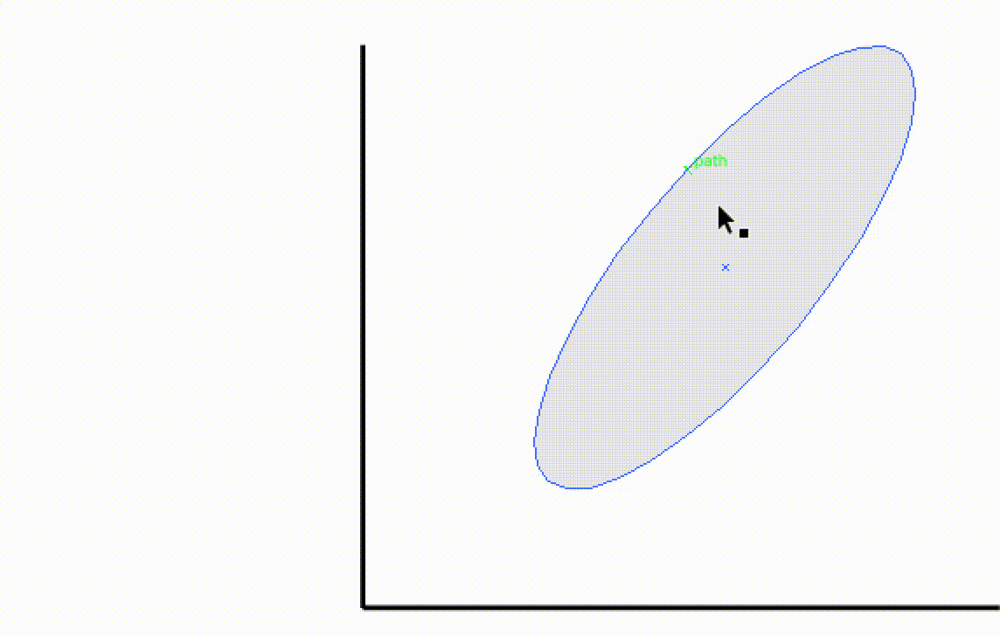

## Gauss2DSamples

Generates points from a 2D Gaussian using the selected ellipse to define the covariance.

## ConnectAllNodes

Connects the centroids of each pair highlighted objects that have a different X (or Y) value. (Useful for drawing network schematics where all nodes in different columns should be connected.)

## How to install/run a script

There are three options for running scripts in Illustrator.

1. In Illustrator, go to "File > Scripts > Other Script..." and then find <script_name>.jsx

2. Drag and drop the script file into the Illustrator Window

3. Install by Placing <script_name>.jsx in the Illustrator Scripts folder

- OS X: /Applications/Adobe Illustrator [vers.]/Presets/en_US/Scripts
- Windows (32 bit): C:\Program Files (x86)\Adobe\Adobe Illustrator [vers.]\Presets\en_US\Scripts\
- Windows (64 bit): C:\Program Files\Adobe\Adobe Illustrator [vers.] (64 Bit)\Presets\en_US\Scripts\
- Restart Illustrator
